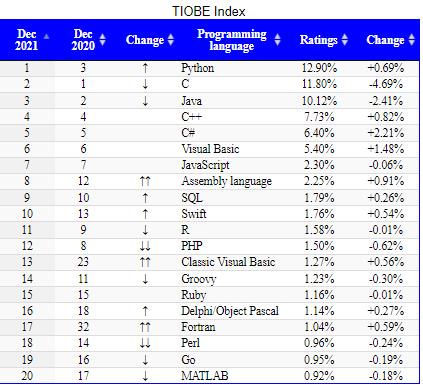
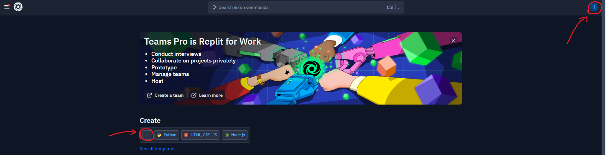
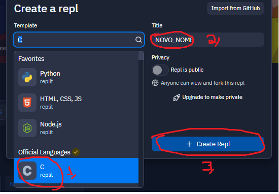
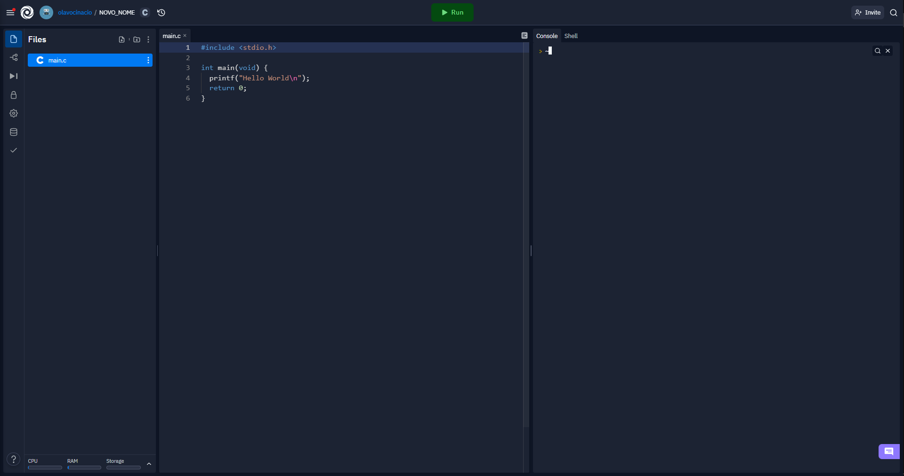
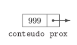
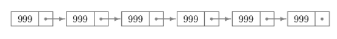

<div style='text-align: justify'>

Aprendendo a programar
=

O que é uma linguagem de programação?
-

Os computadores têm fama de serem muito "inteligentes", mas isso é um mito. Na realidade, eles são só muito obedientes, e precisam que você diga passo a passo (em mínimos detalhes) o que você quer fazer. Sendo assim, você trabalhará com algoritmos, que funcionarão como uma receita de bolo que ele deverá seguir. Mas como já dito, o computador é burrinho, e não entende nossa linguagem. 

A "língua" que os computadores falam é binário (esse sistema recebe esse nome pois só possui duas possíveis entradas, 0 ou 1), provavelmente, nesse momento você deve estar pensando que não seria muito agradável passar um bom tempo contando quantos 0 em sequência você deve digitar até o próximo um, só pra fazer algo simples, como uma soma. E realmente não era uma experiência muito agradável, pra você ter noção, esse é o código escrito para lançamento do foguete Apollo (naquela época, as instruções eram marcadas em papel, com ou sem furo - 0 e 1). 

Para entender um pouco melhor esse processo assista ao vídeo: [How do computers read code?](https://www.youtube.com/watch?v=QXjU9qTsYCc)

Sendo assim, foram criadas novas linguagens para dizer ao computador o que fazer, algo mais próximo da linguagem humana, que seria futuramente "traduzida" para a linguagem de máquina. A primeira linguagem inventada (que foi comercializada) foi o Assembly, em 1947, por Kathleen Booth. Aqui está uma comparação entre um código assembly e um código binário que fazem a mesma coisa, a soma entre dois valores:

Apesar de ser mais fácil que escrever um código direto em binário, concorda que ainda é muito complexo fazer as coisas em assembly? A galera daquela época também achava, e foi assim que a história se repetiu, e foram criadas novas linguagens, baseadas diretamente em binário, ou dessa vez baseando-se em assembly, como é o caso da linguagem que teremos foco no futuro dessa capacitação, a Linguagem C, criada em 1972, por Dennis Ritchie

****

Como estudar?
-

Como um estudante curioso, já procurei por muitos materiais, vídeos, livros e qualquer outra coisa relacionada a programação. Testei diferentes coisas, e apanhei muito, então vou resumir aqui a forma que eu considero mais efetiva para se estudar algo (É claro que você pode adequar isso a sua agenda, suas necessidades, e métodos já utilizados. No final, o importante é que você aprenda).

A primeira cosia que é importante falar quando se trata de estudar, é sobre ser produtivo e ser ocupado. Essas são coisas totalmente diferentes, e você já vai entender o porquê. Sabe quando você passa horas "estudando" para uma matéria, passando pelas páginas do livro perdido, e olhando sem rumo pros exercícios? Então, deixa eu te contar, você não está estudando realmente, você só está se ocupando com uma tarefa que julga importante, mas não a está realizando de uma forma efetiva. Nessas situações você não passa de uma pessoa que está ocupando seu tempo de forma não inteligente. Agora vamos para uma outra situação, aquela em que você ficou apenas uma hora procurando por algum assunto de seu interesse, mas parece que passou a tarde toda estudando, de tanta coisa que aprendeu. Nesse caso, você foi extremamente produtivo.

É claro que não escolhemos quando vamos ser produtivos, mas existem algumas práticas que podem te ajudar a ter esses momentos de "deep focus":

- Tenha um ambiente sem distrações para estudar (Você precisa ser capaz de pensar sem ter suas ideias interrompidas) - Nem sempre você vai conseguir um ambiente totalmente isolado do mundo externo, mas tente criar uma situação o mais próximo do ideal. Se você trabalha bem com música, coloque os fones, coloque uma música que não vai te distrair (deve ser algo que te passe uma sensação de conforto, mas que não vai ter fazer parar de trabalhar para cantar ou dançar), e foque no que está na sua frente naquele exato momento. Uma boa dica para esses momentos é descobrir novas músicas dos seus artistas favoritos

- Tenha um plano de ação - Antes de realmente começar a estudar, você precisa pensar nas suas motivações, o que você quer atingir com isso, pra poder então definir o que é importante de ser estudado. Quando comecei a produzir esse material, por exemplo, pensei primeiramente em meu objetivo com ele, que é tornar você, leitor, apto a trabalhar com a programação de sistemas embarcados, e a partir disso, defini o que seria o roteiro de estudos ideal para isso, criando assim, o sumário desse guia. Como o foco é a programação, achei importante primeiro te ensinar algumas coisas fundamentais pra você entender onde está realmente se enfiando (Falo desse exato capítulo, no caso). Depois disso, te apresentarei um arsenal de armas super poderosas e te ensinarei aos poucos como utilizar cada uma dessas pra atingir o seu objetivo. Temos então a parte de refinar o seu produto e te tornar um guerreiro cada vez mais forte na área de programação, capaz de trabalhar em grupo, conquistar novos territórios e deixar seu legado a novos heróis. Viu como meu plano tinha um começo, meio e fim? Isso que é importante, você traçar um objetivo, e saber o porquê quer aquilo, pra se manter firme e motivado em seu caminho.

- Tenha consistência - Não adianta você estudar uma vez por mês e achar que isso é suficiente para aprender algo novo. Se você quer resultados, precisa ser consistente. Organize uma agenda com todas as suas tarefas e separe um horário específico para seus estudos de programação. O ideal seria que você estudasse pelo menos um pouquinho por dia (coisa de meia hora), mas a gente sabe que o que realmente acontece é que tem dias que acabam não dando, e outros em que a gente consegue estudar até 2 horas. Mas tente manter uma frequência interessante, de pelo menos 3 ou 4 vezes por semana. E comece sempre sua sessão de estudos com uma revisão rápida dos tópicos anteriores. Isso vai te ajudar a manter as coisas sempre frescas.

- Durma bem - Uma mente descansada é importante para que você tenha energia de fazer suas atividades do dia de forma efetiva. Evite ficar muito tempo sem tirar algumas horinhas de sono. Até mesmo o cochilo depois do almoço é algo muito bem vindo.

- Faça atividades físicas - É aquele famoso ditado "corpo são, mente sã". Já foi comprovado científicamente que a prática de atividades físicas é algo infinitamente improtante para seu bem estar, e logo, para o bom desenrolar das demais atividades do seu dia. Se você costuma passar horas sentado, todos os dias, em frente ao computador, depois das primeiras semanas de adaptação, você vai começar a perceber um gás depois de realizar suas atividades físicas e começará a sentir prazer em realizá-las por si só, sem mais essa visão de ser algo para ajudar, e sim sendo uma atividade de lazer.

- Tenha tempo pra você - E falando em lazer, é importante que você tenha também na sua agenda horários definidos para realizar atividades que te deixam feliz, como por exemplo jogar algo com seus amigos, ler um livro, cozinhar, passar tempo com a famíliar ou brincar com seu cachorro. Isso vai te deixar motivado a continuar com sua rotina, tendo em vista que você estará mais animado e disposto a fazer as atividades. 

- Tenha um pensamento crítico das coisas - Enquanto programa, você dará de frente com muitos problemas, e é importante que você saiba ter um olhar crítico da coisa e buscar por diferentes formas de solução, testar e descobrir qual a melhor. Essa sim é a principal função de um programador, e não escrever código, como muitos pensam (nesse caso você não passa de um digitador, que hoje em dia poderia ser substituido até por uma inteligência artificial). O que define um programador é sua capacidade de olhar para um problema e pensar em uma solução efetiva, algo que é desenvolvido com a experiência, e que deve ser exercitado todos os dias. Algumas dicas para solução de problemas: 
    - Identifique e entenda o problema - Tem uma frase famosa de Lincoln, na qual ele diz "Se eu tivesse nove horas para cortar uma árvore, passaria seis horas afiando meu machado", e o que podemos interpretar disso é que é importante você se preparar e estudar bem o que quer fazer antes de realmente fazer a coisa
    - Desmembre o problema -  Busque um contexto em que ele acontece, o que é realmente o problema e qual sua importância (Se for baixa, pense se realmente vale a pena investir tempo em resolvê-lo)
    - Divida grandes tarefas em várias tarefas pequenas - Existem muitas razões pra fazer isso, tais como um melhor entendimento geral da situação, planejamento por etapas (gerando melhores estimativas de tempo demandado), e foco na hora de resolver alguma delas (afinal, você tem uma pequena tarefa pra resolver, ao invés de uma situação gigantesca)
    - Antes de escrever código, escreva um algoritmo a mão (ou no computador mesmo, mas em lingugagem humana). Assim você só precisará "traduzir" suas ideias para que o computado as entenda. 

- Princípio de pareto - "Os primeiros 20% de esforço são os que geram os primeiros 80% de resultado", ou seja, o "grosso" de algo pode ser entendido com a menor parte de todos os  seus esforços. Então aprenda o básico e depois se aprofunde aprendendo de acordo com a demanda de seus projetos

- Se travar, pause e volte depois de um descanso desse problema - Isso não significa que você deve parar tudo que tem pra fazer, e sim pausar aquela tarefa em específico. Quando voltar, comece do 0, estruturando novamente o problema e pensando em novas formas de agir. 

- Pratique, erre, sofra - A melhor forma de estudar programação é praticando, então faça o máximo de exercícios que conseguir, faça alguns projetos simples, se desafie. É só martelando e batendo muito a cabeça que você vai começar a entender como realmente as coisas funcionam e se adaptar para não cometer os mesmos erros ("Erre rápido, pra que possa corrigir o mais cedo possível")

- Digite ao invés de copiar - Muitas vezes você vai acabar encontrando a resposta para um problema em um fórum, com o código já pronto, ou vai acompanhar um tutorial no youtube com o código disponível. Nesses casos, a tentação de usar o famoso "Ctrl + C" e "Ctrl + V" é grande, mas evite isso ao máximo. Quando você precisar replicar um código, leia ele, tente entender e por fim copie manualmente em seu projeto. Isso te ajudará a fixar o conteúdo e se adaptar à sintaxe da linguagem.

- A documentação é sua amiga - Sempre que criam uma nova ferramenta na área de programação, há uma equipe alocada para a construção de uma documentação que ensinará a utilizar essa ferramenta, afinal, ninguém é obrigado a adivinhar como as coisas funcionam. Portanto não se assuste com o quão técnica elas podem parecer às vezes, e sempre que for começar a trabalhar com uma nova tecnologia, busque a documentação da mesma. Chegará um ponto em que você não precisará de mais nada além desse documento para criar seus próprios projetos, nada mais de se matar pra encontrar conteúdo em fóruns, ou no youtube com alguém fazendo a exata coisa que você quer fazer. Ao invés disso, você entenderá os fundamentos e conseguirá aplicá-los em seus próprios projetos.

- Por fim, ensine - Um estudo sobre as formas de estudar diz que a melhor forma de aprender algo, é ensinando isso a outra pessoa (com até 90% de absorção do conteúdo estudado). Então tente documentar as coisas que você estuda, como se estivesse explicando pro você do passado, que ainda não entendia esse conceito, ou pratique explicando isso pra sua família e amigos. Caso se sinta inibído, escreva um diário, se não, mostre isso pro mundo, escreva um blog, crie um canal no youtube, qualquer coisa. O importante é você explicar os conceitos estudados de uma forma clara e concisa. Isso te ajuda a organizar as próprias ideias, te fazendo revisitar conceitos não tão firmados, e construindo um material muito bom no final de tudo.

Tudo isso que eu tenho falado pode parecer papo de coach (e meio que é), mas não se deixe desanimar com toda essa ladainha. Podem parecer besteiras, mas se você criar bons hábitos, verá que com o tempo, as coisas realmente vão parecer se encaixar. Durante a pandemia eu passei por um período difícil, quase tive um burnout, mas consegui me recolocar nos trilhos graças a muitas dessas coisas que eu estou compartilhando com você. No princípio eu também tive dificuldade em entender isso, e tinha também preguiça dessas coisas, mas hoje reconheço a real importância dessa conversa. 

Programando em C
=

O que é C?
-
C é uma linguagem de uso muito amplo, e super consolidada no mercado (tendo em vista que tem 50 anos de idade e continua sendo usada em sistemas modernos). A linguagem C recebeu durante toda sua vida, algumas atualizações e também serviu de base para "novas" linguagens (C++ e C#), com implementação de novos conceitos e funções. Novas entre aspas pois essas podem ser interpretadas como um super pacote da linguagem C, como se ela tivesse recebido um buff, mas mantido sua essência.  Um código escrito em C, por exemplo, é facilmente adaptado para C++ ou C#, tendo em vista que elas compartilham quase toda a mesma sintaxe e semântica (Apesar disso, caso você trabalhe com alguma dessas linguagens algum dia, não se prenda a programar como faria em C e explore o potencial de cada uma, pois se não trouxessem melhoras significativas, nem teriam sido inventadas). Além dessas duas, temos os exemplos de Python e Java que são 100% diferentes de C, mas que foram contruídas baseando-se nessa linguagem, tendo portanto alguns elementos semelhantes, que fazem com que, caso você saiba C, será mais fácil de estudar essas novas linguagens.

Se quiser saber um pouco mais sobre essas diferenças, assista a esse vídeo bem curtinho que te dará um panorama geral:

[C vs C++ vs C# - conaticus](https://www.youtube.com/watch?v=sNMtjs_wQiE)

Aqui agora uma figura com as linguagens mais populares, de acordo com o índice TIOBE de medição, que verifica a quantidade de vezes que algo sobre a linguagem foi procurada em um serviço de busca (como o google, por exemplo). Perceba que C ocupa o segundo lugar nessa classificação, ocupando também o quinto lugar na tabela que segue o índice PYPL de medição (que registra a quantidade de tutoriais buscados a respeito de uma determinada linguagem), provando assim que apesar de antiga, ela continua super em alta.

<center>



</center>

Dentre as aplicações de C e suas variantes, encontram-se:
- Sistemas opercionais (Todos os windows, MAC OS X, Kernel do Linux, Chrome OS, entre outros)
- Navegadores web (Chrome, Firefox, Safari, Opera)
- Office (Microsoft office, libreOffice, Corel Office)
- Clientes de e-mail (Outlook, IBM lotus notes, Mozilla thunderbird)
- Players de mídia (Windows media player, VLC Media player, Software Apple Ipod)
- Bancos de dados (Oracle, MySQL, Microsoft SQL Server, MongoDB, )
- Jogos (GTA, DOOM 3, Counter Strike, Diablo 1 e 2)
- Game engines (Unity, Unreal, Godot)
- Aplicativos de edição (Photoshop, Blender, OBS, Acrobat Reader)
- Outras lingaugens e ferramentas de programação (JavaScript, node.js, TensorFLow, Visual studio)
- **Sistemas embarcados** 

Para a área de embarcados (que é a que nos interessa aqui), a lingugagem C é, sem discussões, a linguagem com maior utilização. Sabendo disso, estudaremos então um pouco sobre como programar nossos sistemas da aviônica usando essa grande aliada. 

Apesar disso tudo, a linguagem C tem sim seus defeitos (como a não implementação do conceito de orientação a objetos; pressupor que o programador sabe o que está fazendo, ocasionando problemas como memory leaks, buffer overruns, segmentation faults) e tem recebido potenciais substitutos muito interessantes, como é o caso do Rust, a maior aposta para substituir C na área de embarcados. Mas deixemos isso como tarefa de casa para um futuro próximo...

****

Ambiente inicial de desenvolvimento
-

Para esse conteúdo inicial, você não precisará configurara nada e nem instalar nenhum programa em seu computador. Vamos facilitara as coisas e utilizar uma IDE online chamada [Replit](https://replit.com/~). Ao abrir, ele pedirá que você logue com uma conta, você pode fazer isso com uma conta google, mas se quiser, aproveite e já crie uma conta no github e faça o login com ela. Em um módulo futuro você utilizará o github para algumas tarefas, portanto se já fizer isso agora, quando chegar a hora, você já terá isso pronto.

Depois de criar uma conta, crie um novo "repl" clicando no botão de "+" da página inicial. Em template selecione "C", dê um novo nome ao seu repositório e clique em criar:

<center>





</center>

Essa será a interface que você verá em seguida:

<center>



</center>
À esquerda temos o seu projeto, com sua árvore de arquivos. É aqui que você organizará seus arquivos e pastas. 

Ao centro, temos seu editor de texto, que é onde você escreverá seu código.

E à direita, temos um console onde serão printadas as informações do seu código compilado (erros, avisos, ou simplesmente os resultados dos seus "printf").

Para rodar o código escrito no seu arquivo "main.c", basta clicar no botão verde de "Run" na parte superior. Na parte de bibliotecas desse documento, você verá como compilar outros arquivos do seu programa além do main.

Antes de começarmos oficialmente então, dê uma olhada nesse vídeo, para ter um panorama geral do caminho que você começará a trilhar:

[C in 100 seconds - Fireship](https://www.youtube.com/watch?v=U3aXWizDbQ4)

****

Estrutura de um código C
-

Vamos então entender como um código em C é estruturado:

``` C
//Isso é um comentário. Tudo que vier precedido de duas barras não é lido pelo computador na hora da execução
//Isso ajuda na hora de documentar o código, deixando informações importantes ao leitor do mesmo

#include <stdio.h> //Chamada da biblioteca standard

//Aqui temos a função main, que será onde o código iniciará
int main(){ 
    //Aqui entra o seu código
    return 0; //Aqui encontra-se o retorno da função. No caso, estamos retornando um valor vazio no main, para indicar que o programa deve ser encerrado
}
```

É importante lembrar que o código será lido de cima para baixo, da esquerda para direita, linha por linha, executando os comandos passados em cada uma dessas.

Além disso, é importante que você **NÃO ESQUEÇA O PONTO E VÍRGULA NO FINAL**. Mas não adianta falar isso agora, é algo que você só se acostumará depois de muitas vezes passar horas procurando um erro no código e descobrir que era um ponto e virgula faltando em uma das linhas

Olá mundo
-

Como de costume, vamos então fazer nosso primeiro código em C, para nos dar boas vindas à linguagem.

``` C
#include <stdio.h>

int main(){
    printf("Olá mundo"); //A função printf retorna a mensagem entre parenteses no console
    return 0;
}
```

****

Variáveis
-

Vamos declarar agora algumas variáveis e estudar seus diferentes tipos

``` C
int inteiro = 3;
float racional = 3.5;
char caracter[1] = "a"; //Entre parêntes é o tamanho do texto
char frase[9] = "Olá mundo";
bool booleano = true;
```


Além dos tipos explícitos de variáveis, temos alguns prefixos, que permitem um comportamento específico em relação a uma variável criada:

```C
static int um = 1; //Um valor local ao módulo atual (conjunto de chaves em que se encontra)
volatile int dois = 2; //A variável não mantém seu valor entre as leituras (extremo oposto de uma const)
const int tres = 3; //Variável imutável, que devolverá um erro caso tente alterar seu valor
extern int quatro = 4; //Uma variável criada em um arquivo diferente do atual, e que será importada
```

Existe ainda uma última forma de declarar um variável, utilizando o "define":

```C
#define pi = 3.1415;
```

Esse é um caso parecido com a const, em que o valor não será alterado, com a diferença de que agora, essa declaração é feita antes mesmo do código começar a rodar. Existem vantagens e desvantagens, e você deve ser muito cuidadoso ao utilizar, para evitar que as coisas saiam do seu controle. 

Para tentar entender um pouco mais, dê uma lida nessa postagem do fórum StackOverflow, e em seus links de referência: [Quando usar const e quando usar #define?](https://pt.stackoverflow.com/questions/136467/quando-usar-const-e-quando-usar-define)

### Printando variáveis <h3>

Cada variável possui um identificador que usaremos para printarmos elas no console, usando o "printf":

``` C
printf("Inteiro : %i", inteiro);
printf("Float: %f", racional);
printf("Char: %s", caracter);
printf("Char: %s", frase);
printf("Bool: %d", booleano); //Printa 1 se for verdadeiro, e 0 se for falso
```

É claro que você não precisa printar com esse exato mesmo texto, mas você deve referenciar o tipo certo da variável com o "%" e depois de fechar a string, colocar uma vírgula e a variável referente.

Para printarmos mais de uma variável, basta repetir o processo:
``` C
printf("O inteiro vale %i e o float vale %f", inteiro, racional);
```

****
Operadores 
-

### Operadores matemáticos <h3>

Símbolo   | Significados 
--------- | ------------  
\- | Subtração 
\+ | Adição 
/ |Divisão 
\* | Multiplicação
\** | Exponenciação
% | Resto da divisão (módulo)

```C
int a = 10;
int b = 3;
int c = 2;
int soma = a+b; //Retorna 13
int sub = a-b; //Retorna 7
int div = a/c; //Retorna 5
int mult = a*b; //Retorna 30
int expo = a**b; //Retorna 1000
int resto = a%b; //Retorna 1
```

### Operadores relacionais <h3>

Símbolo   | Significados 
--------- | ------------ 
== | igual
!= | diferente
< | menor
\> | maior
\<= | menor ou igual
\>= | maior ou igual


Seguem exemplos de utilização de cada um desses:

```C
int a = 10;
int b = 3;
int c = 2;
bool maior = (a>b); //Retorna true
bool menor = (a<b); //Retorna false
bool menor_igual = (a<=b); //Retorna false 
bool maior_igual = (a>=b); //Retorna true
bool igual = (a==b); //Retorna false
bool diferente = (a!=b); //Retorna true
```

****

Condicionais
-

Existem algumas situações em que você vai optar pelo que quer fazer, baseando-se em uma outra informação, como por exemplo uma checagem de tipo, uma comparação entre variáveis ou o resultado de uma operação.

Vamos para o código, para entender exatamente como isso funciona

```C
#include <stdio.h>

int main(){
    int a = 10;
    int b = 2;
    if(a > b){ //Se o que está entre parênteses for verdade, o que está dentro das chaves é feito
        printf("A variável a é maior do que b");
    } else{ //Se não, essa nova chave é realizada
        printf("A variável a é menor do que a");
    }
    return 0;
}
```

Consegue perceber a relação? Lembre sempre que o "if" é um "se" que vai validar a operação entre parênteses, e o "else" é um "se não", o qual o programa só lerá o que está entre chaves, caso o "if" não tenha obtido um retorno verdadeiro.

Além disso, existem casos em que você pode fazer várias operações, e nesse caso, podemos fazer dois tipos de checagem, uma com "else if" (é um "se não" que também tenta validadar uma operação, como no "if", ao invés de ser o último caso):

```C
#include <stdio.h>

int main(){
    int a = 2;
    if(a == 0){ 
        printf("a variável é 0");
    } elif (a == 1){
        print("a variável é 1");
    } else{
        printf("a variável é maior que 1");
    }
    return 0;
}
```

Mas para casos grandes, em que você quer fazer várias checagens comparativas de valor para uma mesma variável, o "else if" não é ideal, pois em um caso que chegue no else, o computador terá perdido muito tempo tentando validar todas as condições impostas. Nesses casos, é mais interessante que utilizemos uma estrutura chamada "switch":

```C
#include <stdio.h>

int main(){
    int a = 2;
    switch(a){
        case 0:
            printf("a variável é 0");
            break; //para a checagem
        case 1:
            printf("a variável é 1");
            break;
        case 2:
            printf("a variável é 2");
            break;
        default:
            printf("a variável é maior que 2"); //equivalente ao else (um caso geral em que nenhuma das condições foi verdadeira)
            break;
    }
}
```

****

Criando funções
-

Existem alguns momentos em que você terá que repetir várias operações de um mesmo tipo em sequência, para economizar o trabalho de copiar e colar repetidas vezes um bloco gigante de texto, você pode criar um bloco de código chamado função.

Aqui está um exemplo prático:

```C
#include <stdio.h>

int main(){
    int a = 2;
    int b = 3;
    int c = 4;
    int d = 5;
    int cinco = soma(a,b); //O retorno da soma de a+b é salvo na variável cinco (que possui esse nome de forma bem clara a respeito do resultado nesse caso), e é printado "resultado = 5" no console
    int seis = soma(a,c);
    int sete = soma(a,d);
    return 0;
}

int soma(int a, int b){
    int resultado;
    resultado = a+b;
    printf("resultado = %i \n", resultado);
    return resultado;
}
```

Percebe como fica muito mais organizado e legível assim do que se fizessemos da seguinte forma?

```C
#include <stdio.h>

int main(){
    int a = 2;
    int b = 3;
    int c = 4;
    int d = 5;
    cinco = a+b;
    printf("resultado = %i \n", resultado);
    seis = a+c;
    printf("resultado = %i \n", resultado);
    sete = a+d;
    printf("resultado = %i \n", resultado);
    return 0;
}
```

Talvez você não tenha notado a grandiosidade das funções, devido à baixa complexidade da operação que estamos realizando, mas imagine um caso em que seja feita a aquisição de dados de um sensor, por exemplo. Seria inviável ter esse código escritos repetidas vezes. 

****

Loops
-

Pensando novamente em otimização, e não repetição, o que faríamos pra executar a função de soma criada no esquema anterior n vezes??

É pensando nesses casos de iteração que existem os loops (ou laços), que sãe estruturas que se repetem de acordo com um parâmetro de saída do mesmo.

Em C existem três principais tipos de laço, são eles

**While:**

Checa a condição antes mesmo de começar, podendo nem entrar no loop caso ela não seja atendida.

```C
#include <stdio.h>

int main(){
    int j = 0;
    while(j < 99){ //Enquanto isso for verdadeiro, o que estiver dentro do loop é executado
        printf("x = %i", aux);
        j++;
    }
    return 0;
}
```

**Do While:**

Garante que o código seja executado pelo menos uma vez, já que a condição só é checada no final.

```C
#include <stdio.h>

int main(){
    int j = 0;
    do{
        printf("x = %i", aux);
        j++;
    } while(j < 99) //Enquanto isso for verdadeiro, o que estiver dentro do loop é executado
    return 0;
}
```

**For:**

Repete n vezes o código, independente de uma condição inicial. Ele sempre será executado ao chegar nele

```C
#include <stdio.h>

int main(){
    for(int aux = 0; aux < 99; aux++){ //for(valor inicial; condição de parada; incremento)
        printf("x = %i", aux); //Tudo que esta entre as chaves será executado em loop
    }
    return 0;
}
```

Nesse caso, implementamos o mesmo código com valor inicial em 0, incremento de 1 e parada em 99, mas como visto nas observações de cada estrutura, elas possuem aplicações específicas de utilização. Você deve ser inteligente para identificar qual a melhor estrutura de repetição de acordo com a sua situação de uso.

****

Structures
-

Em C não temos implementado o conceito de programação orientada a objetos (POO é algo muito importante que trataremos na seção de boas práticas), mas possui algo que lembra (em relação a variáveis) a declaração de um objeto. Essas são as structures, que definem um conjunto de variáveis de diferentes tipos ligadas entre si.

Vamos dar um exemplo prático:

```C
struct carro{
    char modelo[20];
    char marca[20];
    int ano;
    char dono[20];
}
```

Essa é a struct carro, que contem as quatro variáveis, de modelo, marca, ano e dono. Vamos fazer um exemplo agora de como declarar esse valores:

```C
struct carro meu_carro; //Criando a variável meu_carro do tipo carro (definida na struct)

meu_carro.modelo = "Gol";
meu_carro.marca = "Volkswagen";
meu_carro.ano = 1994;
meu_carro.dono = "Daniel";
```

Agora temos a variável "meu_carro", com suas "subariáveis" definidas, e que podem ser acessadas a qualquer momento. Esse conceito é muito útil quando você precisa organizar elementos relacionados a variás variáveis iguais, pois você tem um grau a mais de abstração.

****

Listas
-

Podemos também criar listas com várias variáveis do mesmo tipo. Essa estrutura é chamada array, e ela é declarada da seguinte forma:

```C
int numeros_primos[5] = {1,2,3,5,7};
char dias da semana[7][10] = ["segunda", "terça", "quarta", "quinta", "sexta", "sábado", "domingo"]; //A primeira dimensão indica a quantidade de termos na lista (7 termos), e o segundo é o tamanho dos chars de cada item (máximo de 10 caracteres)
```

No caso da lista de chars que fizemos, ela funciona como uma matriz (uma lista de duas dimensões). Isso pode ser feito também com outros tipos de variável, e no lugar de cada item da lista principal, teremos uma sublista:

```C
int numeros[4][3] = {{1,2,3},{4,5,6},{7,8,9}};
```

E para acessar os termos de cada uma dessas listas, basta chamar o nome da lista com o termo desejado entre os colchetes.

```C
printf("O primeiro número primo é: %i", numeros_primos[0]); //É importante perceber que a contagem dos index (posição) começa em 0, e não no 1
printf("Hoje é %s", dias_da_semana[6]); //Logo, o último termo será representado pelo tamanho da lista menos um. Nesse caso, printamos "Hoje é domingo"
printf("Cinco: %i", numeros[1][1]);

```

****

Ponteiros
-

A abordagem que teremos dentro desse tópico será mais simplista, tendo em vista que é um assunto um tanto quanto complexo. Apesar disso, deixarei recomendações de materiais que auxiliarão a atingir uma compreensão maior sobre o assunto, te permitindo aplicar esses conhecimentos no futuro. Lembre-se também que a documentação é sua amiga, e você pode, e deve buscá-la quando tiver alguma dúvida.

Um ponteiro guarda um endereço de memória. Utilizamos isso para acompanhar e manipular o alocamento de variáveis dentro de um código.

Exemplo mais simples:

```C
int numero = 5;
int *posicao = &numero; //O ponteiro posição aponta para o endereço de memória em que está alocada a variável numero
```

Isso nos dará controle de onde nossas variáveis estão sendo armazenadas dentro da memória, permitindo que utilizemos de técnicas como a alocação dinâmica e a criação de listas encadeadas, por exemplo.

### Sobre alocação dinâmica: <h3>

Utilizaremos alocação dinâmica para reservar uma porção de memória durante o tempo de execução da aplicação. Para isso usaremos duas principais funções, a "malloc" e a "free":

```C
int * endereco_regiao_alocada; //Criando o ponteiro que apontará para a região
endereco_regiao_alocada = (int *)malloc(10*sizeof(int)); //Criação da região de tamanho de 10 ints

if(endereco_regiao_alocada != NULL){ 
    //Se o endereço retornado for válido, podemos operar com o ponteiro
} 

free(endereco_regiao_alocada); //Libera a região de memória para outras tarefas
endereco_regiao_alocada = NULL; //Agora o ponteiro não mais possui um endereço válido
```

Para maior entendimento e se aprofundar no assunto, recomenda-se as seguintes fontes:

[Ponteiro em C: Alocação dinâmica de memória - Fernando Deluno Garcia](https://www.embarcados.com.br/ponteiro-em-c-alocacao-dinamica/)

[Alocação dinâmica em C - Profa Rosana Braga USP](http://wiki.icmc.usp.br/images/5/59/Aula14-AlocacaoDinamica.pdf)

[Alocação Dinâmica em C - Eduardo Casavella](http://linguagemc.com.br/alocacao-dinamica-de-memoria-em-c/)

### Sobre listas encadeadas: <h3>

Como o próprio nome diz, aqui nós teremos várias listas linkadas, umas as outras, formando uma grande lista no final. Mas como isso funciona e o que isso tem a ver com ponteiros?

Quando estamos programando temos que nos atentar às regiões de memória que temos disponível para armazenar nossas informações sem interferir nas variáveis de ambiente(relacionadas por exemplo ao seu sistema operacional, ou aplicações que estão rodando). E isso é ainda mais agravante em embarcados, quando temos um espaço muito menor de alocação. Em uma lista convencional, nossas variáves são armazenadas em endereços de memória subsequentes, mas nesse caso alocaremos cada variável em um lugar qualquer vazio de nossa memória e teremos consciência de qual o próximo endereço a partir de um ponteiro que apontará para seu endereço: 

<center>

 



</center>

Vamos agora criar uma lista encadeada então, para isso criaremos uma struct com o conteudo que queremos salvar e o ponteiro apontando para o próximo item:

```C
struct registro{
    int conteudo;
    struct registro *prox;
}

typedef struct registro celula; //Tratando as células como um novo tipo de dado

celula c; //Referente ao conteudo
celulca *p; //Referente ao ponteiro

c.conteudo; //será o conteúdo
c.prox; //Será o endereço da próxima
```

Pode-se então usar os conceitos estudados no tópico de alocação dinâmica para ir salvando esses valores em locais disponíveis da memória. 

Para uma melhor compreensão do assunto e estudo de exemplos recomenda-se os seguintes materiais:

[Listas encadeadas - Paulo Feofiloff Ime Usp](https://www.ime.usp.br/~pf/algoritmos/aulas/lista.html)

[Listas dinâmicas encadeadas em C - Veslasoft](https://www.youtube.com/playlist?list=PL1EkVGo1AQ0HgYpSwWwt_7JnavxRmCwt0)


****

Bibliotecas e arquivos externos
-

Uma biblioteca é um arquivo com porções de código que já foram escritos e que por muitas vezes possuem funções extremamente úteis. Temos que agradecer muito aos abençoados que criam bibliotecas com funções que nos tomariam 100 linhas e muita dor de cabeça se fóssemos escrevê-las. Mas como já fizeram isso, tudo que precisamos fazer é importar esse pacotes e utilizar dessas funções.

Você, sem perceber, está fazendo isso desde seu primeiro código. A biblioteca "stdio.h" é uma das mais utilizadas, devido ao caráter fundamental de suas funções (como a "printf", por exemplo). Como dito, você já sabe então que a importação de uma biblioteca se dá da seguinte forma:

``` C
#include <stdio.h>
```

Além da "stdio", existem variás outras bibliotecas que serão grandes aliadas durante a sua vida de programação, e você irá as decobrindo de acordo com sua necessidade. Mas para não te deixar perdido agora no começo, deixarei aqui uma lista com algumas bibliotecas interessantes e suas utilizações:

1. **math.h**
    - Biblioteca com várias funções matemáticas prontas, como média, raiz quadrada, entre outras
2. **string.h**
    - Manipulação de strings (conjuntos de char)
3. **alloc.h**
    - Função para gerenciamento da memória
4. **stdlib.h**
    - Funções de uso geral, como conversão de tipos, organização de arrays, etc

Além disso, você pode organizar seu código em vários arquivos (o que é extremamente interessante e será citado na seção de boas práticas), e até mesmo criar suas próprias bibliotcas.

Nesses casos, você fara a importação do arquivo existente na mesma pasta de origem do seu arquivo atual da seguinte forma:

``` C
#include "my_lib.h"
```

Nesse caso, seu único arquivo ".c" será o principal,e os demais funcionaram como bibliotecas de onde você importará funções, variáveis, e qualquer outra coisa que quiser, logo, devem receber a terminação ".h"

O compilador tem como padrão o início da sua leitura no arquivo "main.c", você até consegue alterar isso, mas não é algo que valha a pena. Habitue-se a ter esse arquivo para chamar as rotinas proveniente dos seus demais arquivos. Isso além de mais cômodo, é uma boa prática que facilita o entendimento aos demais programadores, que saberão também que devem começar a estudar o código por esse arquivo.

***

Exercícios
-

Bom, agora você já tem uma boa base em relação à sintaxe de C e deve estar apto a criar seus próprios códigos. Para confirmar isso, resolva os seguinte exercícios em um repositório público do Replit, e envie o link desse para "olavo1611@gmail.com". Caso tenha dúvidas, não se acanhe em me chamar também.

1. Crie um código em C que printe n números da sequência fibonacci (o primeiro deverá sempre ser o número 1,e número n de repetições deve ser escolhido pelo usuário)

2. Crie um código em C que leia os valores de um array de 10 posições, e calcule a média, a moda e a mediana de tais valores (cada um desses resultados deve ser retornado por uma função responsável por realizar as operações necessárias para encontrá-lo)

3. Crie um código em C para cadastro de automóveis, utilizando structures. (O usuário deve entrar com o modelo, ano e cor do carro, e esses valores devem ser adicionados a uma lista salva em um arquivo txt)

4. Escreva um programa que declare um inteiro, um real e um char, e ponteiros para inteiro, real, e char. Associe as variaveis aos ponteiros (use &). Modifique os valores de cada variável usando os ponteiros. Imprima os valores das variáveis antes e após a modificação.

***
</div>