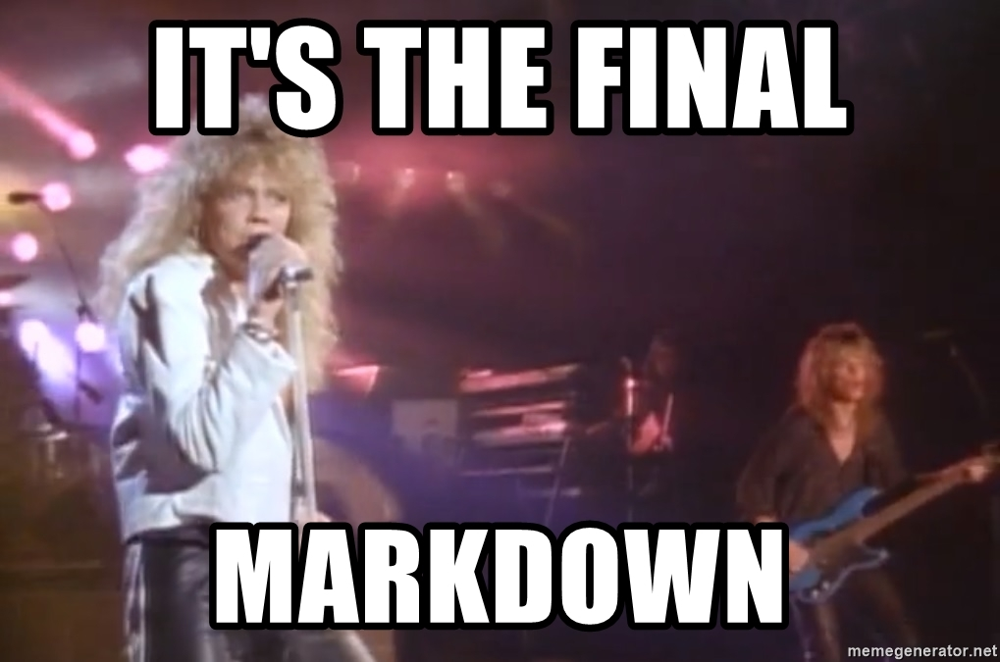

<div style='text-align: justify'>

Por que documentação é importante?
=

Bom, começando do começo, vamos primeiro entender o que se entende pelo processo de documentação no ramo da programação e em sequência poderemos entender sua real importância para TODO e QUALQUER projeto. 

A definição dada pela Wikipedia (Sim, eu sei que não é a melhor fonte, mas nesse caso serve) para "Documentação de software" é a seguinte:

"A documentação de software ou documentação do código fonte, é um texto escrito que acompanha o software e geralmente explica como utilizá-lo. O termo pode significar coisas diferentes para pessoas de várias funções . Os textos podem acompanhar uma função, uma classe, um simples trecho ou módulo, ou consistirem num conjunto de manuais gerais e técnicos, e além de diagramas explicando o funcionamento do programa como um todo ou cada parte dele."

Ou seja, documentação é aquele material (de qualquer tipo que seja) que ensine o funcionamento e lógica por trás de um produto desenvolvido. Uma receitinha de bolo, um manual de como usar sua mais nova furadeira ultra mega power blaster (Pra nós, nosso queridinho C, por exemplo).

Diferente de coisas no mundo real, em que a gente consegue olhar pra uma coisa e fazer suposições de como usar a partir de seu funcionamento, é impossível criarmos tais hipóteses no ambiente virtual das linguagens de programação, porque se o autor de uma função super útil, que organiza todos os itens de uma lista em ordem alfabética e os formata, pode chamar essa função de "asioyub()" e você nunca vai saber (E sim, eu só me esparramei pelo teclado pra achar esse nome). Isso que é o belo da programação, a total liberdade, mas ela também é perigosa, e é por isso que muitas vezes tentamos nos prender a algumas técnicas que permitem o melhor entendimento do nosso código. As principais técnicas são a aplicação de algumas boas práticas (padrões combinados para facilitar a interpretação e legibilidade do código) e é claro, que o assunto do qual estamos falando, a criação de uma boa documentação.

É criando esse documento que explica tim tim por tim tim do que deve ser feito para fazer seu programa funcionar, que o seu eu do futuro, os desenvolvedores que vão te suceder, e seu usuário entenderam a ferramenta e serão capazes de usar e até mesmo dar manutenção ou melhorar algo na mesma.

Você viu no tópico anterior, quando falamos de git, que uma das plataformas mais populares para disponibilização de código fonte, e agora eu vou te contar mais um segredo sobre ele. Se você é um pupílo curioso e deu uma explorada pelo site, claramente percebeu que a página inicial de cada um era totalmente diferente da outra, e que possuia um texto bem bacana, com uma formatação show e algumas imagens do projeto. Isso é documentação, e o documento que está sendo exibido nessa primeira página quando o projeto é aberto, chama-se "README.md". Ele se encontra na pasta raíz do projeto e o github entende que deve renderizá-lo para ser exibido nessa página quando alguém abre o projeto, atuando como um cartão de visitas, dependendo do caso. E o que significa essa extensão ".md"? É o que você deve estar se perguntando (provavelmente não se perguntou de verdade, mas a gente finge que sim), e eu te explicarei sobre em nosso próximo tópico, em que falaremos dos arquivos do tipo "Markdown".

O que é markdown e como utilizar?
=
markdownguide.org/getting-started/

https://docs.pipz.com/central-de-ajuda/learning-center/guia-basico-de-markdown#open


Headers
=
```markdown
Título
=

Subtítulo
-

# Título 1 <h1> Subtítulo
## Título 2 <h2>
### Título 3 <h3>
#### Título 4 <h4>
##### Título 5 <h5>
###### Título 6 <h6>

# Alternative heading
```

Heading
=

Sub-título
-
# Título 1
## Título 2 <h2> 
### Título 3 <h3>
#### Título 4 <h4>
##### Título 5 <h5>
###### Título 6 <h6>

# Alternative heading

De onde surgem esses "h"? HTML e como podemos usar ele em documentação

Parágrafos separados por uma linha em branco

Dois espaços no fim de uma linha produzem uma quebra de linha  
teste

Atributos de texto: _itálico_, **negrito**, `monospace`

```markdown
_itálico_
**negrito**
`monospace`
```

Régua horizontal:

---

```markdown

```

Listas:
1. Frutas
    * maçã
    * banana
2. Vegetais
    - cenoura
    - brócolis

Assim se adiciona um link: [google](htt´://google.com)



> Criando um bloco de citações
>
> Múltiplos parágrafos

Aqui já acabou (pulando duas linhas)


A maior parte de comandos <abbr title="Hypertext Markup Language">HTML</abbr> é suportado

``` js
//Criando um bloco de código:
function teste(){
    return "Olá";
}
```

Criando tabelas
=


Criando uma boa documentação
=
---

Agora que você sabe usar markdown, a linguagem oficial da documentação no github, vamos aprender os principais pilares para escrevermos uma bela documentação

Por que você deve documentar?

Onde editar markdown:
- vs code
- github
- dillinger.io

</div>