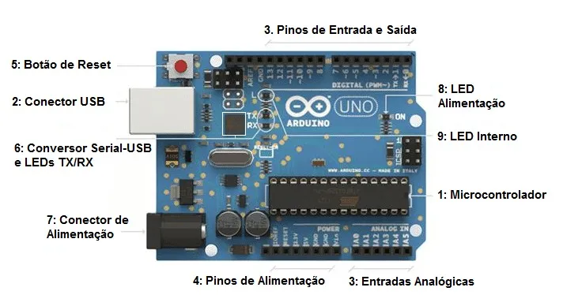
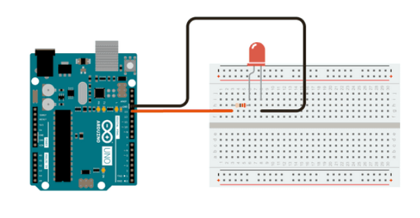

<div style='text-align: justify'>

Introdução
-

Agora que você já sabe realmente programar, tem suas bases bem definidas e entende os conceitos de documentação e versionamento de código, poderemos aplicar esses conhecimentos na área de sistemas embarcados, o que é desde o princípio nosso principal interesse. Pra começar a tratar desse assunto, falaremos de uma das placas mais populares de todas, o arduino. Nesse texto, abordarei os conceitos de forma mais simplista, te expondo aos conteúdos e esperando um trabalho um pouco maior de interpretação. Isso será uma forma de exercitar sua compreensão sobre o assunto e também te dar liberadade para fazer experimentos.

Para uma abordagem mais passo a passo, com exemplos e explicações mais detalhadas, recomenda-se o minicurso já produzido pela equipe:

[Minicurso Básico de Arduino - EPTA Team](https://youtube.com/playlist?list=PLbg_WGkwf-zCj7u5-jyxQvOzqxt84f9Rt)

O que é arduino
-

Quando falamos de Arduino, existem três possibilidades. Podemos estar falando de uma placa, de uma ide, ou de uma biblioteca. Todas essas coisas juntas formam uma plataforma muito potente para prototipagem eletrônica e construção de projetos, desde os mais simples aos mais complexos. Mas vamos por partes então, entender o que é cada uma esas interpretações.

### A placa <h3>

Arduino refere-se nesse caso, a um conjunto eletrônico composto por um microcontrolador (Item 1 na imagem) e elementos de interface (Todos os itens demais). Falando de forma simples, ele é um computador muito pequeno, que você pode usar para enviar comandos para atuadores eletrônicos ou mecânicos (Como por exemplo, um motor, um led, ou um rádio), e receber informações de sensores (De temperatura, pressão, inclinação, etc), através de conexões feitas pelos pinos demonstrados no item 3 da imagem.



### A IDE <h3>

A arduino IDE é um programa que foi construído para você programar e enviar seu código para a placa de forma mais simples e intuitiva.  Como você pode observar na imagem, temos uma área e edição de texto, assim como no repl.it, e também alguns botões de comando na parte superior. O primeiro é o botão de compilar, o qual você utiliza para checar se tudo está nos conformes para ser enviado. E o segundo botão, é justamente o bntão utilizado para carregar seu código na sua placa.


### A biblioteca <h3>

Arduino pode também ser interpretada como uma biblioteca de C (Por isso a importância da base que tivemos nessa linguagem. Será ela que utilizaremos aqui e também quando estivermos trabalhando com o esp). Ou seja, caso você abra um arquivo de texto em um editor que não a arduino ide, crie um arquivo do tipo ".c" e em suas primeiras linhas usar o comando "#include <arduino.h>" você poderá agora criar um código que será interpretado por uma placa arduino. Dessa forma você se torna independente da Arduino IDE, podendo programar no ambiente que você se sente mais confortável, e utilizar algo como "platformIO" (Uma extensão do vs code) para enviar seu código para a placa depois (Inclusive, um spoiler, é dessa forma que faremos com nossos códigos do esp no futuro).

Uma análise um pouco mais profunda desses tópicos pode ser encontrada em: [O que é arduino, pra que serve e primeiros passos - filipeflop](filipeflop.com/blog/o-que-e-arduino/)

Instalação
-

Para instalar a arduino IDE, você pode acessar o site [arduino/software](https://www.arduino.cc/en/software), baixar o executável e seguir aquele batido protocolo de instalação, em que você geralmente só clica em "next" sem nem saber o que está acontecendo, ou, caso queira ser diferentão e já usar o platformIO, você pode seguir os seguintes passos:

1. Instalar o vs code em [visual studio](https://code.visualstudio.com/), no mesmo pique de rodar um executável e clicar em next
2. Ao abrir o vs code, apertar "Ctrl + shift + x" para abrir o painel de extensões 
3. Procurar pela extensão PlatformIO IDE e instalá-la. ELa deve se configurar sozinha, e no fim você já estará apto a usá-la
4. Siga as instruções do tópico 5.2 dessa capacitação para carregar seu código

Mas é claro, isso só vale caso você tenha uma placa arduino em casa. Caso isso não seja verdade, você pode usar o site [tinkercad](https://www.tinkercad.com/), e usufruir de um simulador online de arduino, com vários sensores. Essa foi a abordagem utilizada no minicurso apresentado no começo desse capítulo, então lá você encontrará mais informações a respeito.

"Hello world" (Blink)
-

Vamos então para o nosso primeiro exemplo. Assim como fizemos o "hello world" quando estávamos estudando C, faremos agora um código que explicará a estrutura básica de um código arduino e te mostrará algumas funções bem úteis. Para esse caso, teremos um led que ficará 1 segundo ligado e 1 segundo desligado, repetindo isso em um ciclo infinito.

Primeiro vamos então entender o circuito



Trata-se de um esquema muito simples, com o negativo do led ligado ao gnd (terra) da placa, e o polo positivo ligado a um pino de saída pelo qual enviaremos, ou não, a tensão para acender o led. 

Indo para o código:

```Arduino
//void setup(){} -> Função padrão do arduino para inicialização. É a primeira coisa a ser executada 
void setup(){
    pinMode(PINO_LED, OUTPUT); //PINO_LED deve ser o nº da porta em que o led está ligado
}

//void loop(){} -> Depois de executar o setup, o loop será iniciado, e se repetirá infinitamente a menos que haja uma interrupção programada
void loop(){
    digitalWrite(PINO_LED, HIGH); //Define o estado desse pino como HIGH (ligado), fazendo passar corrente, e ligando o led
    delay(1000); //Espera 1000 ms (1s) antes de executar o próximo comando
    digitalWrite(PINO_LED, LOW); //Define o estado da porta como LOW (desligado), fazendo com que não mais passe corrente, desligando o led
    delay(1000);
}
```

Para mais exemplos simples e que ilustram o funcionamento da placa, acesse : [Arduino/built-in-examples](adocs.arduino.cc/built-in-examples/)

Além disso, como já dito no tópico 1.1, sua maior aliada ao estudar uma nova tecnologia é a [documentação](https://www.arduino.cc/reference/en/), então recomendo fortemente que dê pelo menos uma olhada por cima da mesma, para ter uma noção das possibilidades, e o que a arduino oferece.

Quando tratamos de componentes e módulos eletrônicos, temos também um manual do mesmo, que se chama "datasheet". Então caso você tenha em mãos uma placa para realizar as atividades de exemplo, recomendo que dê antes uma olhada no datasheet do modelo correspondente ao seu. Sempre que você começar a trabalhar com um novo microcontrolador, é importante você entendê-lo a fundo, para extraír o máximo deste e evitar erros bobos, como a utilização de uma porta não compatível com a tarefa desejada.

Alguns sensores
-

Mas é claro que você não usará o arduino por si só, e que o mais interessante é utilizar vários e vários sensores. Mas não se preocupe, pois o grau de complexidade aqui continuará o mesmo, com a ressalva de que a documentação (incluindo datasheets) que você deverá estudar é agora um pouco mais extensa, e que você terá que, claramente, abstrair mais as coisas e ligá-las de forma a tornar seu código fluído.

Felizmente, para a maioria dos sensores, boas almas tiveram o trabalho de criar bibliotecas de forma a facilitar o trabalho ao mexer com esses. Nós já falamos sobre bibliotecas, e você já deve estar muito bem habituado com o conceito de abstração e criação de coisas de um "nível mais alto", então imagino que entenda as motivações e também os possíveis problemas (como processamento não tão otimizado, bugs da biblioteca, entre outros). Mas mesmo que você fizesse tudo nos mínimos detalhes, ainda haveriam riscos a correr, e como muitas dessas bibliotecas recebem atenção quase constante da comunidade, basta que você entenda os principais problemas denotados pelos usuários, e o funcionamento a baixo nível da coisa, para evitar tais falhas e se preparar para as situações em que isso possa acontecer.

E como você pode achar a biblioteca de um sensor?? É simples, papai google do céu quase sempre tem um exemplo de código do seu sensor em funcionamento com arduino (pode ter certeza), mas além disso, você pode acompanhar pelo site oficial da arduino, várias [bibliotecas](https://www.arduino.cc/reference/en/libraries/) que podem lhe ser úteis. 

Como eu disse, não quero me prolongar muito nesse assunto, pois as possibilidades são inúmeras, e por mais que eu me esforce, construir uma base de todas essas possibilidades, seria extremamente cansativo. Sendo assim, o indicado aqui é que você aprenda as coisas por demanda. Pense em projetos (alguns serão propostos no exercício), busque exemplos parecidos, entenda o que foi feito, adeque, e tente construir uma coisa única. 

Em um caso mais específico da aviônica na EPTA, por exemplo, você não precisa ter todo o entendimento de como funcionam sensores de umidade, pois você não os utilizará (pelo menos não na equipe), mas precisa entender muito bem o comportamento do acelerômetro escolhido, seus limites de operação, frequência de amostragem, e conhecer a biblioteca do mesmo, de forma a ser capaz de criar um código para o mesmo.

Exercícios
-

Para confirmar confirmar que você entendeu os conceitos desse capítulo responda as perguntas abaixo (as teóricas devem ser escritas em um .txt e salvas em um arquivo com o número da questão, enquanto os projetos devem ter um .txt com o número da questão no nome, e em seu conteúdo um link do tinkercad, ou uma foto do projeto físico e o projeto da arduino ide), e envie o link desse para "olavo1611@gmail.com". Caso tenha dúvidas, não se acanhe em me chamar também.

1. Escolha 3 sensores distintos (caso seja membro da aviônica, recomenda-se que estude sensores utilizados no projeto), comente um pouco sobre as informações contidas no datasheet do mesmo, e escreva um pequeno código de exemplo para que o mesmo funcione adequadamente (deve haver verificações de falhas)

2. Crie uma rotina com um sensor de sua escolha, que a partir de uma constatação execute uma segunda tarefa, como por exemplo, o sensor escolhido pode ser um termômetro, que ao bater 40ºC (constatação) girará um servo motor em 35º (segunda tarefa)

3. Escolha duas placas diferentes do arduino, e cite pelos 3 vantagens e 3 desvantagens de cada uma na realização de um mesmo projeto (cite o projeto e crie seus argumentos baseando-se nas limitações do mesmo, como por exemplo espaço, alimentação, quantidade de periféricos, etc)


</div>