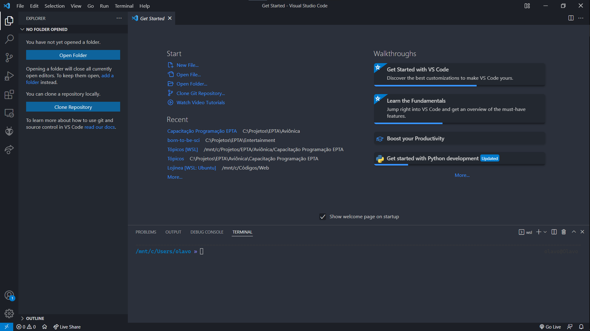
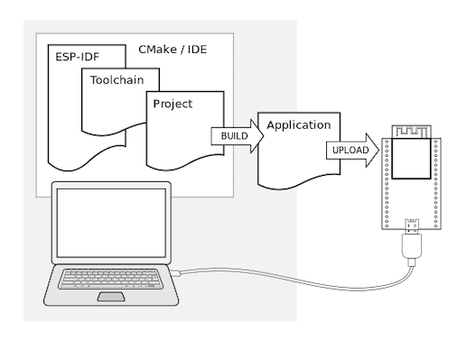

https://docs.espressif.com/projects/esp-idf/en/latest/esp32/

https://docs.espressif.com/projects/esp-idf/en/latest/esp32/get-started/index.html

https://github.com/espressif/vscode-esp-idf-extension/blob/master/docs/tutorial/toc.md

http://esp32.net/

https://github.com/espressif/vscode-esp-idf-extension/blob/master/docs/tutorial/basic_use.md

Primeiros passos com ESP
=

Agora você é moço grande e revoltado, disse à mamãe Arduino que quer sair de casa, viver a vida de maneira mais emocionante, conhecer novas coisas e expandir os horizontes. Para isso você precisa de um processamento mais potente, e não quer mais estar preso à biblioteca da arduino. Vamos então conhecer um processador fera em custo-benefício, mais potente que o arduino, e que te permite trabalhar com operações mais complexas e inclusive utilizar um sistema operacional.

O que é ESP
-

### Comparação com o Arduino <h3>

Instalação
-

Vamos aprender aqui o passo a passo para trabalahr sem usar a Arduino IDE, mas você poderia sim optar por manter a plataforma de programação, mudando só para um controlador mais potente, mas daremos um passo adiante e trabalharemos de forma mais próxima ao nosso controlador, garantindo assim maior domínio da aplicação ao programador.

Primeiro, você precisará instalar o Visual Studio Code, que será o editor de texto que utilizaremos. Nele existem várias opções de configuração e extensões para baixar, nos permitindo construir um ambiente super poderoso de desenvolvimento.

Sua primeira visão dentro do programa deve ser a seguinte:

Nada muito diferente do que estamos acostumados, certo? Uma árvore de arquivos à esquerda, nosso editor de texto na parte superior, e um console na parte inferior. Mas aqui temos várias opções diferentes nos limites da borda esquerda, que nos serão bastante úteis (em um tópico futuro posso focar em sobre como utilizar o vs code de maneira mais produtiva). Vale a pena comentar que talvez no seu esteja faltando algumas opções, e isso é porque eu já possuo algumas extensões instaladas que acabam adicionando ícones a essa barra. 

Agora que você está com o vs code instalado, siga o seguinte tutorial para instalar e configurar a extensão do esp32:

[vscode esp idf extension](https://github.com/espressif/vscode-esp-idf-extension/blob/master/docs/tutorial/install.md)

Depois de instalar a extensão, você precisará instalar alguns outros programas necessários para compilar seu código. O esquema em cascata o qual estamos preparando é o seguinte:

Já temos instalada a ferramenta de upload (nossa extensão), mas agora precisamos instalar as ferramentas que vão trasnformar nosso código em uma aplicação que o controlador entenda.

Para isso, siga o seguinte tutorial, de acordo com seu sistema operacional:

[Windows](https://docs.espressif.com/projects/esp-idf/en/latest/esp32/get-started/windows-setup.html)

[Linux e macOS](https://docs.espressif.com/projects/esp-idf/en/latest/esp32/get-started/linux-macos-setup.html)

### Blink <h3>

freeRTOS
-
Sistemas operacionais embarcados

Otimizações
-
### Debouncing <h3>

### Sobre timers <h3>

### Interrupções <h3>

### Paralelismo <h3>

Exercícios
-

